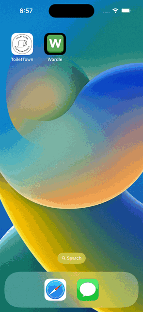

# Project 1 - *Wordle*

Submitted by: **Juan Linares Orihuela**

**Wordle** Wordle is a popular word puzzle game that challenges players to guess a secret five-letter word within six attempts. The game provides feedback on each guess by indicating which letters are in the correct position (in green) and which letters are part of the secret word but in the wrong position (in yellow). Players use deductive reasoning and word knowledge to narrow down the possibilities and ultimately guess the correct word. Wordle is known for its simplicity, addictive gameplay, and the satisfaction of cracking the word code within the limited attempts, making it a favorite word game for puzzle enthusiasts. 

Time spent: **4** hours spent in total

## Required Features

The following **required** functionality is completed:

- [x] App displays a keyboard on the screen
- [x] When tapping on the keyboard, a letter is shown or deleted (letter selected)
- [x] User can play a basic version of Wordle, with different goal words each time

The following **optional** features are implemented:

- [x] Improve and customize the user interface by adding a launchscreen and app icon
- [x] Run the app on a device rather than in the simulator

## Video Walkthrough

Here is a reminder on how to embed Loom videos on GitHub. Feel free to remove this reminder once you upload your README. 

## Notes

Throughout the course of working on this project, I did not encounter any significant challenges. The tasks and exercises provided were well-defined, and the codebase was clear and structured, making it easy to follow and implement the required changes. Additionally, the comments within the code provided helpful guidance for each task, ensuring a smooth and straightforward development process. Overall, it was a seamless and enjoyable experience, with no notable obstacles encountered during the project.

## License

    Copyright [2023] [Juan Linares Orihuela]

    Licensed under the Apache License, Version 2.0 (the "License");
    you may not use this file except in compliance with the License.
    You may obtain a copy of the License at

        http://www.apache.org/licenses/LICENSE-2.0

    Unless required by applicable law or agreed to in writing, software
    distributed under the License is distributed on an "AS IS" BASIS,
    WITHOUT WARRANTIES OR CONDITIONS OF ANY KIND, either express or implied.
    See the License for the specific language governing permissions and
    limitations under the License.
